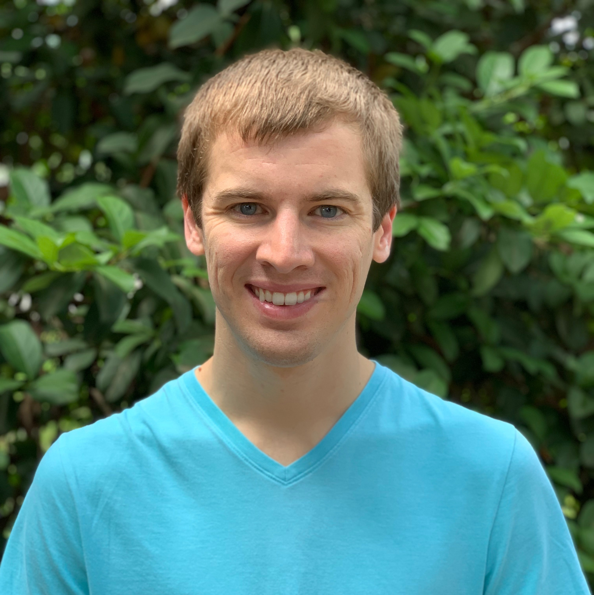
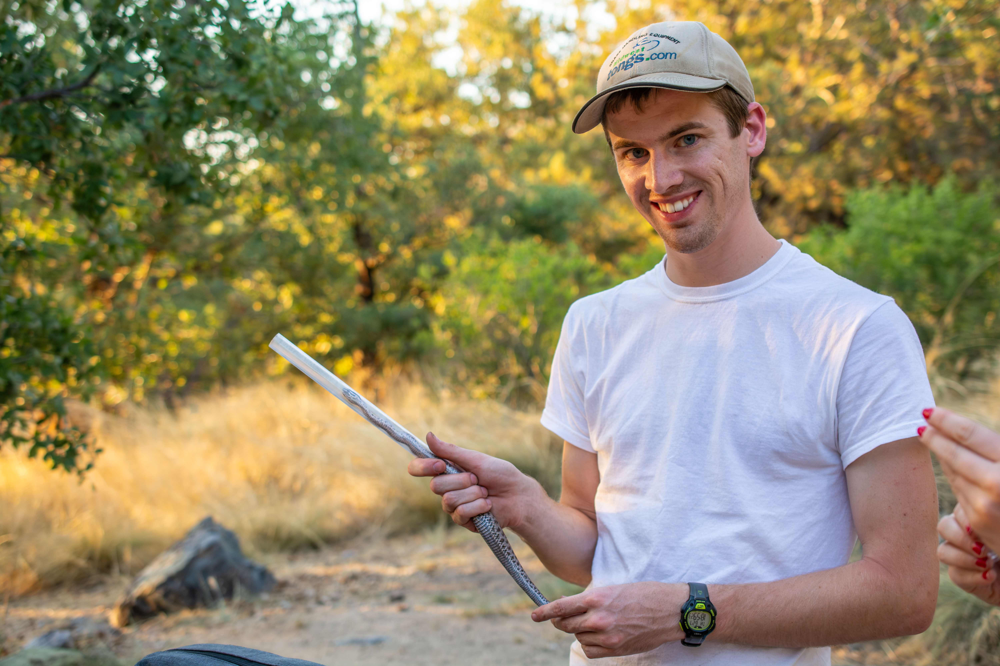
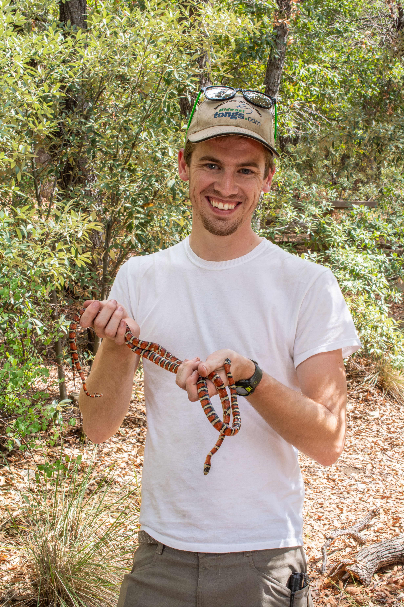
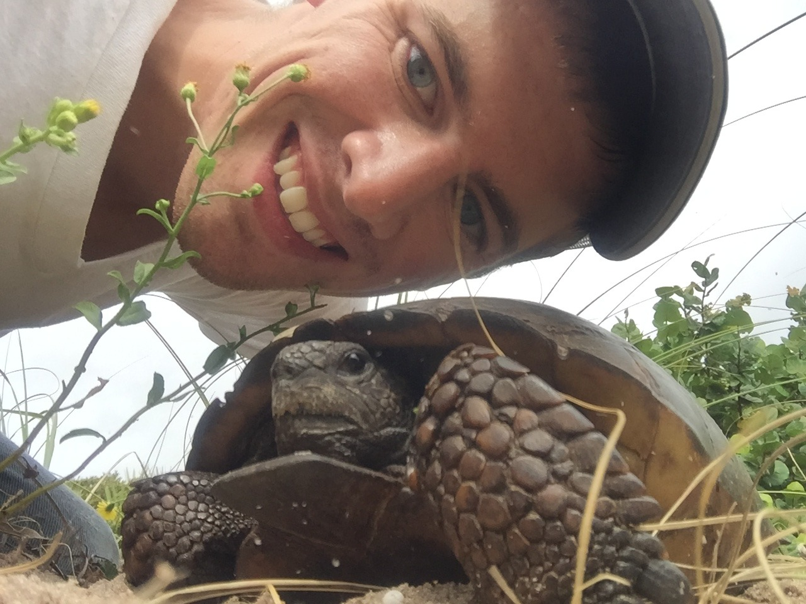
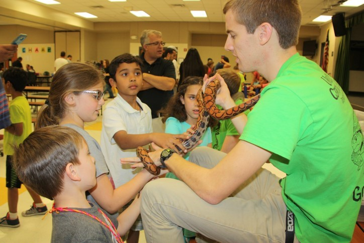
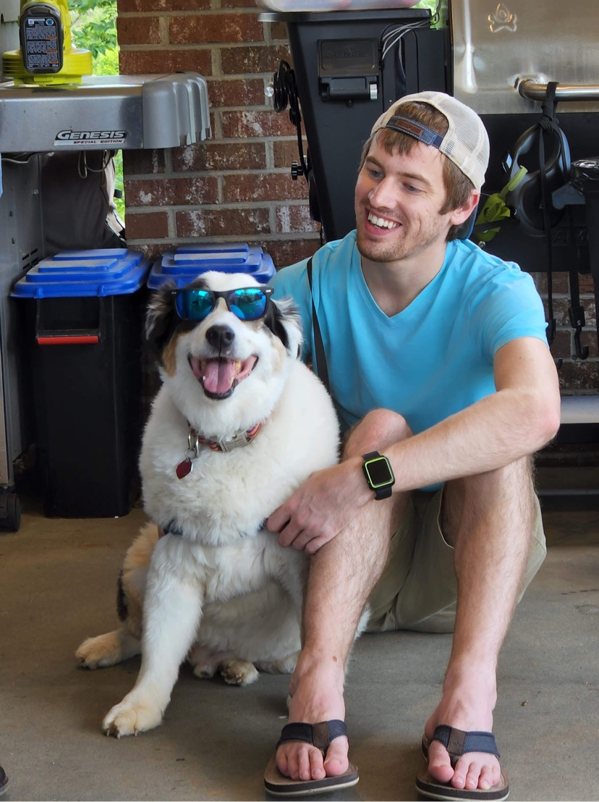
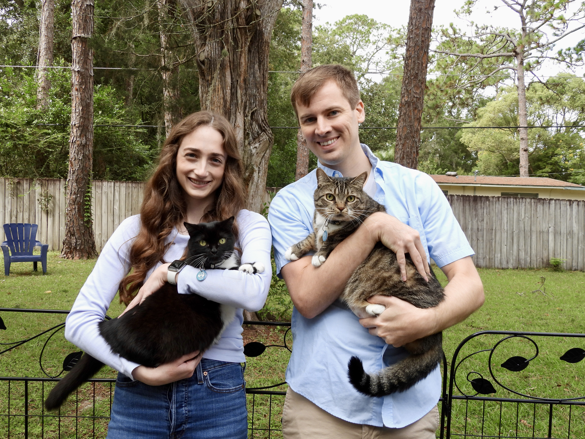
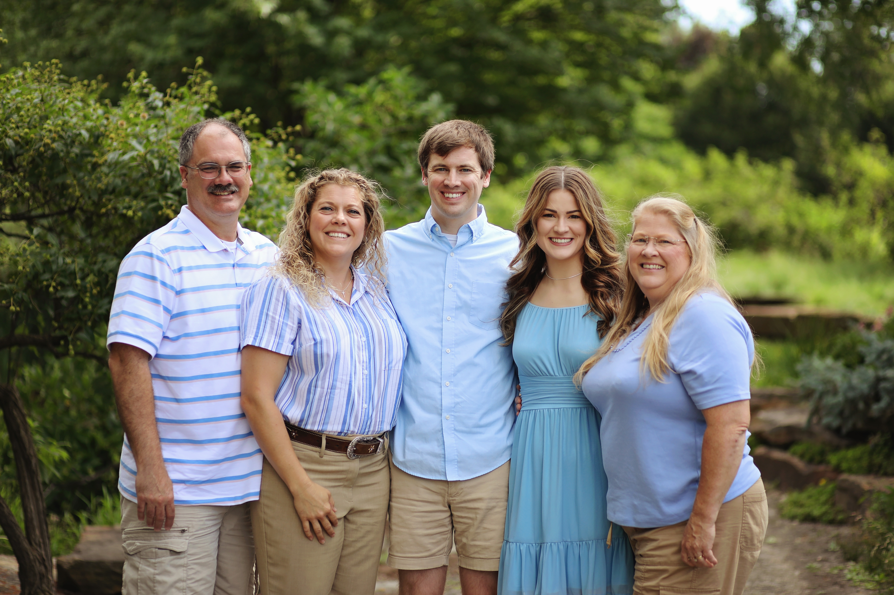

---
hide:
  - navigation
  - toc
---

  
  

    <h1><b>Rhett M. Rautsaw</b></h1>
    
Senior Scientist, Field Applications Bioinformatic Support, PacBio   Bioinformatics | Genomics | Evolution | Ecology | Conservation

  

  

# Welcome. My name is Rhett Rautsaw. 

I am currently a senior bioinformatic support scientist at Pacific Biosciences. I have more than  years of experience in genomics, bioinformatics, statistics, scripting, pipeline/application development, data analysis, and scientific communication. I am primarily interested in finding ways to transform complex multiomic data (i.e., genomic, transcriptomic, epigenomic) into usable information that advance our understanding of biology.

In my current position, my role is to:

1. Educate scientists on the benefits of HiFi long-read sequencing across a variety of applications.
2. Provide hands-on bioinformatic support and training for scientists using PacBio sequencing technologies.
3. Assist scientists in managing and analyzing data using the latest bioinformatic tools and pipelines.
4. Provide feedback to help develop and improve bioinformatic tools and pipelines.

## Academic Background

{ width=50%, align="right" }
{ width=50%, align="right"}

My research focuses on the integration of genomics, evolution, ecology, and conservation biology to study molecular ecology and eco-immunology through the lens of species interactions in two systems:

1. Snake Speciation & Venom Evolution
2. Tasmanian Devils & Transmissible Cancer

My overarching research agenda aims to answer how species interactions influence evolution at different spatial, taxonomic, and temporal scales as well as across different levels of biological organization from genomes to communities. 
​

Learn more on my [Research](research/index.md) page.

## Career Timeline

::gantt::whole-years no-quarters no-weeks month-width=5

- title: Milestones
  events:
  - title: Wright State University
    time: 2012-08-01
    icon: "images/logos/WrightStateUniv2.png"
  - title: University of Central Florida
    time: 2014-08-01
    icon: "images/logos/UCF.png"
  - title: Clemson University
    time: 2017-08-01
    icon: "images/logos/Clemson.png"
  - title: University of South Florida
    time: 2022-07-01
    icon: "images/logos/WSU.png"
  - title: Pacific Biosciences
    time: 2023-05-01
    icon: "images/logos/PacBio.png"

- title: B.S.
  activities:
    - title: Wright State University
      start: 2012-08-01
      end: 2014-05-12
- title: M.S.
  activities:
    - title: University of Central Florida
      start: 2014-07-01
      end: 2017-05-12
- title: Ph.D.
  activities:
    - title: Clemson University
      start: 2017-08-01
      end: 2022-08-01
- title: PostDoc
  activities:
    - title: Washington State University
      start: 2022-07-01
      end: 2023-05-01
    - title: University of South Florida
      start: 2022-07-01
      end: 2023-05-01

- title: PacBio
  activities:
    - title: Scientist II, FABS
      start: 2023-05-01
      end: 2025-02-01
    - title: Senior Scientist, FABS
      start: 2025-02-01
      end: 2027-01-01

::/gantt::

 

## Who am I outside of work?

I am a field biologist at heart, so it should be no surprise to know that I spend a lot of my free time outdoors. I enjoy hiking, kayaking, camping, biking, (amateur) wildlife photography, and (of course) looking for snakes. I also enjoy soccer, both playing and watching – particularly the World Cup. When I'm not outside, I enjoy playing video games (e.g., Legend of Zelda) as well as rewatching my favorite TV shows (e.g., How I Met Your Mother) and movies (e.g., Star Wars and Harry Potter) over and over again. 

  
  
  
  
  
  
  

### Travel

I also enjoy traveling – and although I would like to do it more often – I have been fortunate enough to visit some incredible places. Check out the map of places I've traveled below. 

<!-- Add this wherever you want the map to appear -->

  <button id="map-fullscreen-button" class="map-fullscreen-button" type="button" aria-label="Expand map to full screen">Full screen</button>
  

<!-- Leaflet CSS & JS -->
<link
  rel="stylesheet"
  href="https://unpkg.com/leaflet@1.9.4/dist/leaflet.css"
/>

<!-- Additional functions -->

