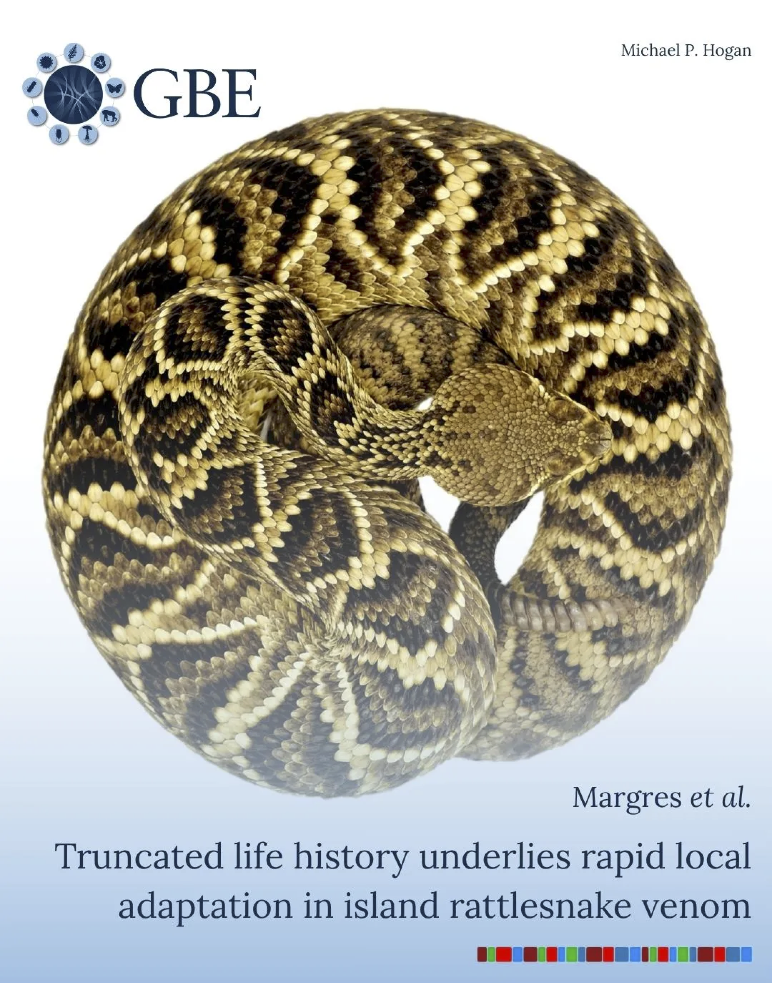
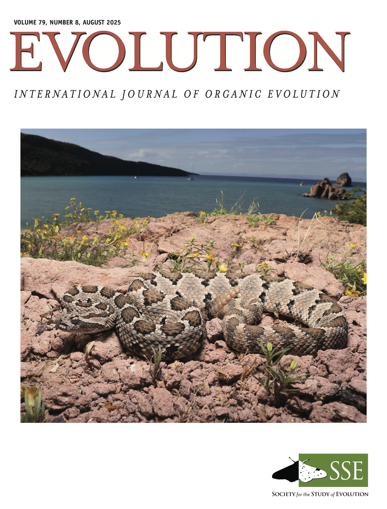
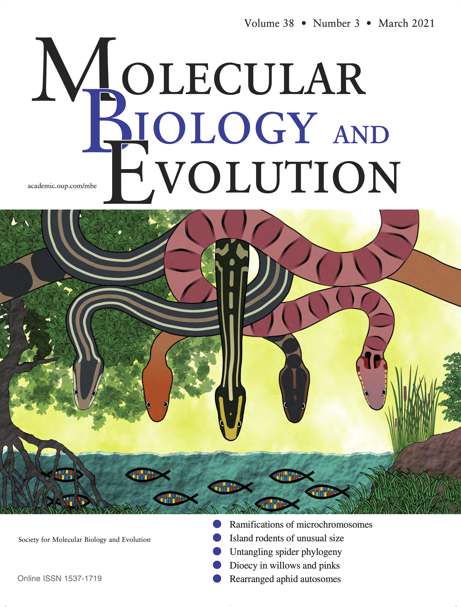
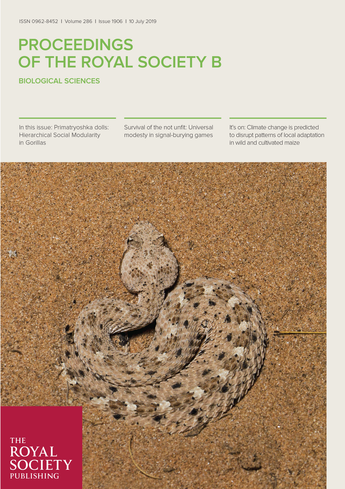
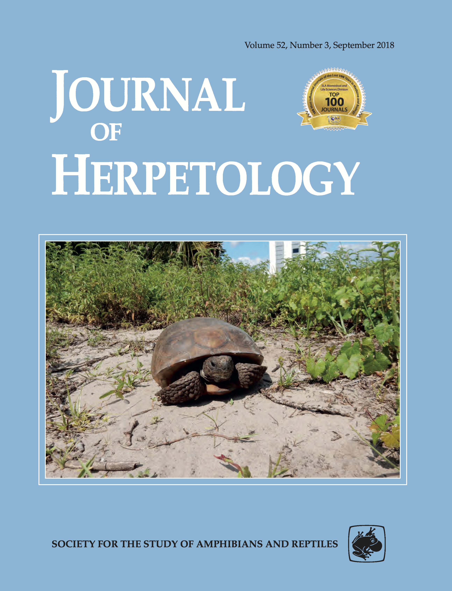
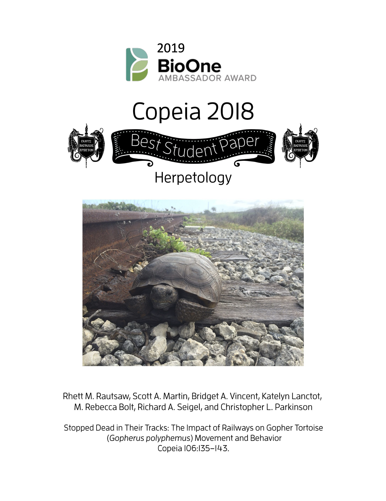

## Cover Articles

      <a href="peer_review/2026-06_Margres_GBE.pdf" class="cover-article-card">
        
        Genome Biology and Evolution, 2026
      </a>
      <a href="peer_review/2025-04_Hirst_Evolution.pdf" class="cover-article-card">
        
        Evolution, 2025
      </a>
      <a href="peer_review/2025-02_Heptinstall_IntOrgBio.pdf" class="cover-article-card">
        
        Integrative Organismal Biology, 2025
      </a>
      <a href="peer_review/2022-06_Myers_GBE.pdf" class="cover-article-card">
        
        Genome Biology and Evolution, 2022
      </a>
      <a href="peer_review/2021-03_Rautsaw_MBE.pdf" class="cover-article-card">
        
        Molecular Biology and Evolution, 2021
      </a>
      <a href="peer_review/2019-07_Rautsaw_RSPB.pdf" class="cover-article-card">
        
        Proceedings of the Royal Society B, 2019
      </a>
      <a href="peer_review/2018-04_Rautsaw_JHerp.pdf" class="cover-article-card">
        
        Journal of Herpetology, 2018
      </a>
      <a href="peer_review/2018-03_Rautsaw_Copeia.pdf" class="cover-article-card">
        
        Ichthyology & Herpetology (Copeia), 2018
      </a>

## Peer-Reviewed Publications [:fontawesome-brands-google-scholar:](https://scholar.google.com/citations?view_op=list_works&hl=en&hl=en&user=vL483VkAAAAJ&sortby=pubdate)



| No. | Citation | PDF | Altmetric | Dimensions |
|:---:|----------|:---:|:---------:|:----------:|


| --- | <h1> {{ pub.year }} </h1> | --- | --- | --- |

| {{ pub.number }}  :trophy: *{{ pub.badges | join(' & ') | upper }}* | {{ pub.citation }} | <h1>[:fontawesome-solid-file-pdf:]({{ pub.pdf }})</h1> | {{ pub.altmetric_html }} | {{ pub.dimensions_html }} |


## Natural History Notes

| No. | Citation | PDF |
|:---:|----------|-----|
| 3. | Franz-Chávez H, Ramírez-Chaparro R, Pérez-Fiol T, López-Martínez DE, **Rautsaw RM**, Hirst SR, Rodriguez-Lopez B, Borja M, Castañeda-Gaytán G, Strickland JL, Parkinson CL, Reyes-Velasco J, Margres MJ. 2023. New herpetological records for islands in the Gulf of California. *Bulletin of the Chicago Herpetological Society* 58(8):129–130. | <h1>[:fontawesome-solid-file-pdf:](natural_history_notes/2023-08_Franz-Chavez_BCHS.pdf)</h1> |
| 2. | **Rautsaw RM**, Holding ML, Strickland JL, Castañeda-Gaytán JJ, García-González FC, Castañeda-Gaytán JG, Borja-Jiménez JM, Parkinson CL. 2018. *Hypsiglena tanzeri* (Tanzer’s Night Snake): Geographic distribution. *Herpetological Review* 49(2):287. | <h1>[:fontawesome-solid-file-pdf:](natural_history_notes/2018_Rautsaw_HerpReview.pdf)</h1> |
| 1. | **Rautsaw RM**, Yanick CJ*, Medina S*, Parkinson CL, Martin SA, Bolt MR. 2016. *Gopherus polyphemus* (Gopher Tortoise): Predation. *Herpetological Review* 47(3):447–448. | <h1>[:fontawesome-solid-file-pdf:](natural_history_notes/2016_Rautsaw_HerpReview.pdf)</h1> |

## Other Publications
| No. | Citation | PDF |
|:---:|----------|-----|
| 2. | **Rautsaw RM**. 2022. *Phylogenomics of vipers and the role of competition on venom evolution*. PhD Dissertation. *Clemson University*. | <h1>[:fontawesome-solid-file-pdf:](other/2023_Rautsaw_PhD-Dissertation/Rautsaw_Dissertation.pdf)</h1> |
| 1. | **Rautsaw RM**. 2017. *The paths less traveled: Movement of gopher tortoises (*Gopherus polyphemus*) along roads and railways*. MS Thesis. *University of Central Florida*. | <h1>[:fontawesome-solid-file-pdf:](other/2017_Rautsaw_UCF_MS-Thesis.pdf)</h1> |
