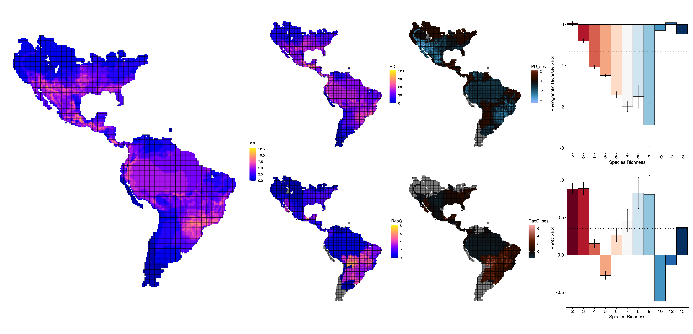
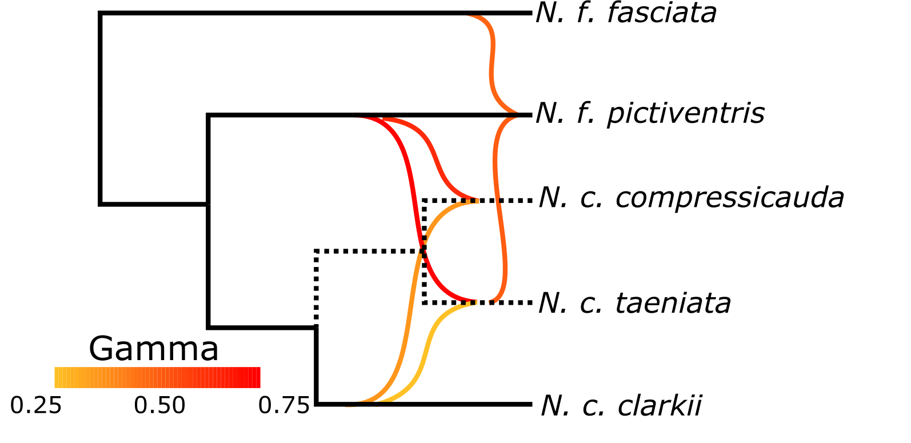
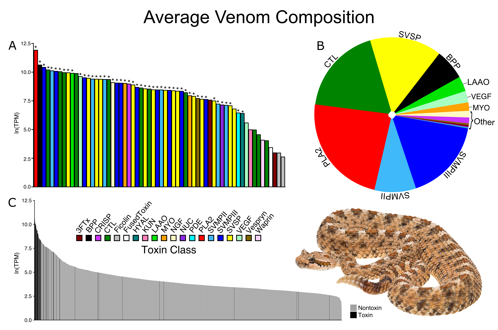
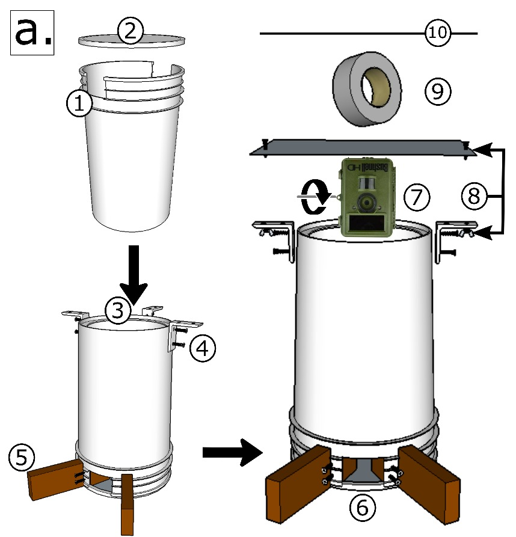
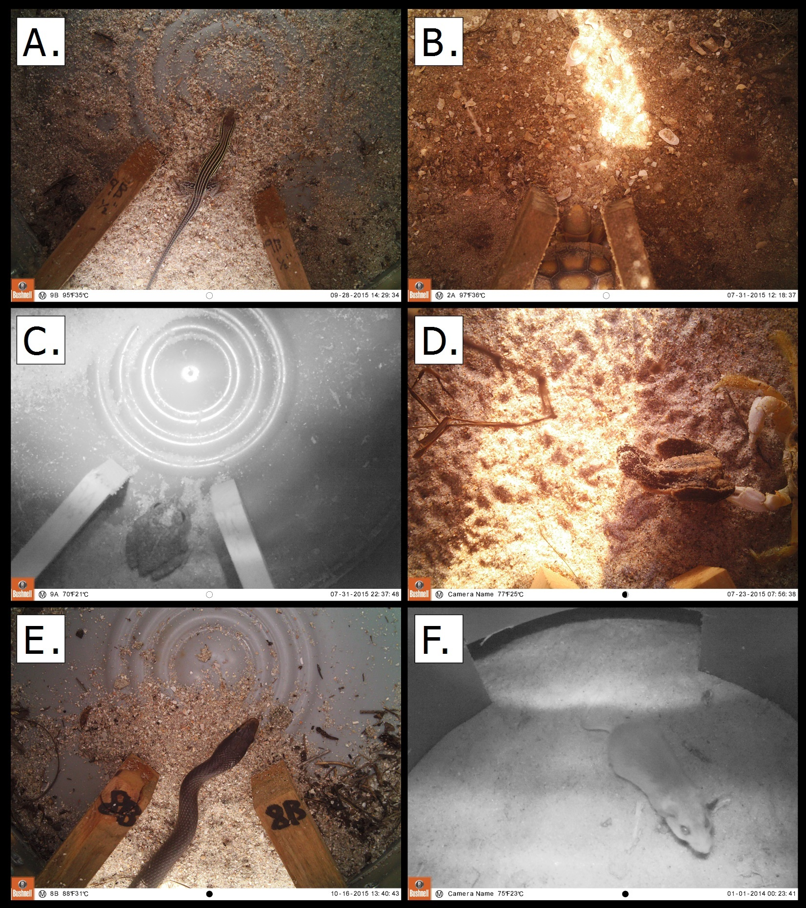

---
hide:
  - navigation
  - toc
---

  <video class="research-video" data-lazy-video muted loop playsinline preload="none" aria-label="Crotalus willardi video">
    <source data-src="images/Crotalus_willardi.mp4" type="video/mp4">
  </video>
  

    <h1><b>Research</b></h1>
  

My research focuses on the integration of genomics, evolution, ecology, and conservation biology to study how species interactions influence evolution. I do this through a lens of molecular ecology and eco-immunology working within two primary study systems:

1. Snake Speciation & Venom Evolution
2. Tasmanian Devils & Transmissible Cancer

My overarching research agenda aims to answer how species interactions influence evolution at different spatial, taxonomic, and temporal scales as well as across different levels of biological organization from genomes to communities.

I focus on these systems because they possess characteristics that enable me to advance our understanding of species interactions. First, snakes represent one of the best studied groups for understanding speciation dynamics in the face of ongoing gene flow and hybridization. Additionally, venomous snakes represent a model system for studying adaptation, trait evolution, and mechanisms of gene regulation given venom’s high variation, genetic tractability, and critical roles in predator-prey and competitive interactions. 

Second, the origin of transmissible cancers in Tasmanian devils represents a recent and rapidly evolving host-pathogen system with ample sampling across both time and space since disease emergence. This system provides us with a naturally occurring long-term evolutionary experiment to study coevolution in-action and understand the evolutionary patterns and processes related to disease. 

  <video class="research-video" data-lazy-video muted loop playsinline preload="none" aria-label="Crotalus pricei video">
    <source data-src="images/Crotalus_pricei.mp4" type="video/mp4">
  </video>
  

    <h1><b>Snake Speciation & Venom Evolution</b></h1>
  

### Viper Phylogenomics [:fontawesome-solid-file-pdf:](../publications/other/2023_Rautsaw_PhD-Dissertation/Rautsaw_Dissertation.pdf)

{align="right", width="50%"}

Despite being one of the most well-studied groups of snakes, the evolutionary history of vipers remains uncertain. The rapid radiation of vipers creates significant challenges for phylogenetic and biogeographic inference which has been compounded by a lack of genetic resolution as only a handful of mitochondrial and nuclear loci have been used in previous studies, resulting in a high degree of uncertainty and unstable placement of many genera and species. To address this, I used next generation sequencing methods to reconstruct the phylogeny and biogeography of vipers. 

### Character Displacement & Macroevolution

{align="right", width="50%"}

Imagine sitting down at a restaurant with your cousin and you notice a fork already in their hand. As you guys catch-up, the waiter brings a bowl of spaghetti and a bowl of soup. They then turn to you and ask "Would you like a fork or a spoon?". Your options are take the fork and fight your cousin over the the spaghetti or take the spoon and have a peaceful lunch to yourself.
 
This scenario is fairly common in evolutionary biology – it is called character displacement. Specifically, closely related species may diverge in phenotype/traits when they overlap to avoid competition (one uses a fork and the other a spoon), but when they live apart they may both have similar traits (both use forks). One other thing you might notice is that timing matters – if your cousin was already sitting down with a fork in their hand, it makes more sense for you to grab the spoon instead.
 
For my dissertation at Clemson University, I tested whether venom in pitvipers show this pattern of divergence in closely related co-distributed species. Notably, venom is an ecologically important trait used for prey capture and prey often develop resistance to venom. Therefore, if one pitviper species has venom specialized to a given prey species, a close relative has the option to produce a similar venom and compete – or evolve a novel venom and focus on different prey resources. 

I found that venom phenotypes diverge when multiple species coexist in a given area through time via positive diversity dependence. Furthermore, we find that pitviper communities have evolved to maximize functional diversity despite comparatively low phylogenetic diversity, suggesting an evolutionary response of venom rather than communities accumulating phylogenetically diverse species. Together, these findings support competition as a likely selective pressure driving venom diversification in pitvipers.

### Watersnake Population Genomics & Adaptation [:fontawesome-solid-file-pdf:](../publications/peer_review/2021-03_Rautsaw_MBE.pdf)

{align="right", width="33%"}

Florida Banded Watersnakes (*Nerodia fasciata*) and Salt Marsh Snakes (*Nerodia clarkii*) are sister taxa (i.e., they are very closely related). They are known to hybridize, but are considered separate species due to presumed ecological divergence between freshwater and coastal saltwater habitats. To understand the extent of gene flow/hybridization and test for evidence of ecological divergence – we performed next-generating sequencing techniques across the Florida peninsula. Despite ongoing gene flow among closely related lineages, we found that adaptation to salinity helps maintain genomic differences between freshwater and saltmarsh-associated populations. These results suggest that natural selection can preserve locally adapted coastal watersnake lineages even when hybridization continues, with important implications for conservation of saltmarsh specialists like the Atlantic Salt Marsh Snake.

### Sidewinder Rattlesnake Venom Evolution [:fontawesome-solid-file-pdf:](../publications/peer_review/2018-10_Hofmann-Rautsaw_SciRep.pdf) [:fontawesome-solid-file-pdf:](../publications/peer_review/2019-07_Rautsaw_RSPB.pdf)

{align="right", width="33%"}

Sidewinder Rattlesnakes (*Crotalus cerastes*) are an iconic rattlesnake species well known for their desert-specialized strategy of locomotion and the scales that resemble horns above their eyes. However, despite being distributed from California to Arizona and further south into Northwest Mexico, very little is known about their venom. In many species which occupy the same range, venom is highly divergent between populations, so we wanted to know whether this same pattern held for Sidewinders. 
​
We used transcriptomics and proteomics to characterize the venom of Sidewinders across their range in the United States and test for differences in their venom expression patterns between evolutionary lineages. Overall, we found that venom is largely consistent with other rattlesnake species, but most variation in the venom was on the individual level and was not related to evolutionary lineages, subspecies, or age.

  <video class="research-video" data-lazy-video muted loop playsinline preload="none" aria-label="Tasmanian devil video">
    <source data-src="images/TasmanianDevil.mov" type="video/quicktime">
  </video>
  

    <h1><b>Tasmanian Devil & Transmissible Cancer</b></h1>
  

### Tasmanian Devils & Transmissible Cancer

Coevolution is common and frequently governs host–pathogen interaction outcomes. Phenotypes underlying these interactions often manifest as the combined products of the genomes of interacting species, yet traditional quantitative trait mapping approaches ignore these intergenomic interactions. Devil facial tumor disease (DFTD), an **infectious cancer** afflicting Tasmanian devils (*Sarcophilus harrisii*), has decimated devil populations due to universal host susceptibility and a fatality rate approaching 100%. 

In my postdoc, I used PacBio HiFi sequencing to compare the genomes of the Tasmanian Devil and DFTD. Specifically, I was looking for evidence of chromothripsis and genes impacted by large structural variation (e.g., oncogenes or tumor-suppressing genes) that may have facilitated the evolution and persistence of DFTD across the population. Additionally, using direct methylation detection from HiFi sequencing, I aimed to compare and detect hypo/hypermethylation across the DFTD genome by comparing two samples from different timepoints. 

  <video class="research-video" data-lazy-video muted loop playsinline preload="none" aria-label="Gopher tortoise railway video">
    <source data-src="images/GopherTortoise_Railway.mov" type="video/quicktime">
  </video>
  

    <h1><b>Ecology and Conservation</b></h1>
  

### Gopher Tortoise Movement Ecology [:fontawesome-solid-file-pdf:](../publications/peer_review/2018-04_Rautsaw_JHerp.pdf) [:fontawesome-solid-file-pdf:](../publications/peer_review/2018-03_Rautsaw_Copeia.pdf)

  <video class="research-video" data-lazy-video muted loop playsinline preload="none" aria-label="Gopher tortoise timelapse video">
    <source data-src="images/GopherTortoise_Timelapse.mp4" type="video/mp4">
  </video>
  <video class="research-video" data-lazy-video muted loop playsinline preload="none" aria-label="Gopher tortoise railway camera video">
    <source data-src="images/GopherTortoise_RailwayCamera.mp4" type="video/mp4">
  </video>
  
  

Gopher Tortoises (Gopherus polyphemus) are known as ecosystem engineers because the burrows they dig provide shelter for over 360 different species throughout the Southeastern United States where they are distributed. However, despite their importance in the ecosystem, their populations are slowly declining due to habitat destruction and urbanization including the presence of roads and railways. For my Master's degree at the University of Central Florida, I researched the impact of roads and railways on Gopher Tortoise movement. 

Overall, we found that:

- Roadsides are used as normal habitat by tortoises and may function as ecological traps.
- Railways are significant barriers to movement, but trenches dug beneath between railway ties may be used as escape routes 

[**Check out my outreach for this work!**](../scicomm/index.md)

### Using Game Cameras to Detect Reptiles, Amphibians, and Small Mammals [:fontawesome-solid-file-pdf:](../publications/peer_review/2017-09_Martin_WSB.pdf)

Game cameras are becoming more and more common in ecological studies to characterize communities and calculate abundance of species. However, normally, game cameras are only useful for detection of large mammals and other warm-blooded (endothermic) animals. Small, cold-blooded animals are difficult to detect because they cannot trigger the infrared sensors on the cameras. In collaboration with Scott A. Martin, we developed and tested a method to combine drift fences (a common method of trapping reptiles) and game cameras to detect small animals including ectothermic reptiles and amphibians. This method is entitled Adapted-Hunt Drift Fence Technique or AHDriFT for short. 

We also utilized this method to test if man-made coastal sand dunes used to combat sea-level rise and climate change are quickly colonized and utilized equally to natural sand dunes.
​
Overall, we found that:

- Our method was highly sensitive and capable of detecting all sizes of reptiles, amphibians, and even small invertebrates such as velvet ants and centipedes. 
- There were some differences between natural and man-made dunes, but these differences were largely driven by rarely observed species.
- When accounting for rare species, man-made dunes and natural dunes are equal. Therefore, man-made dunes represent a successful management strategy for coastal populations
