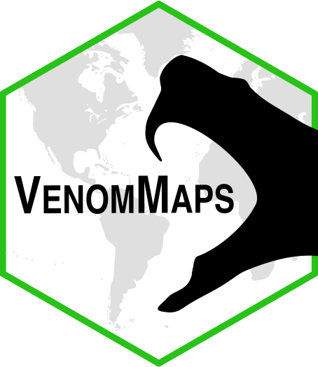
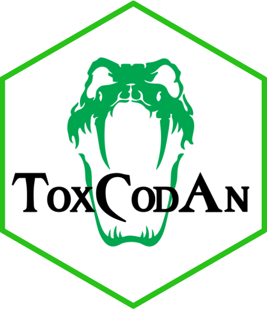
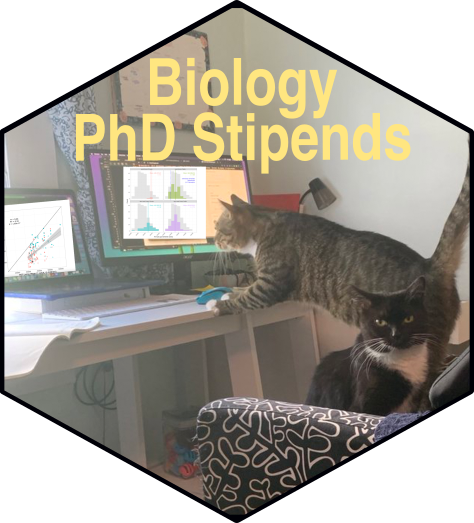
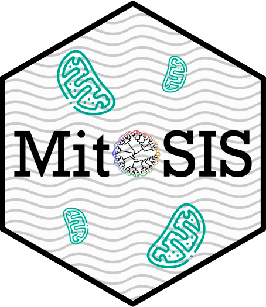
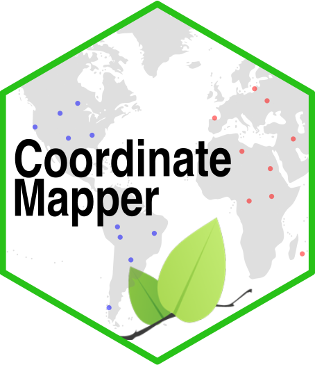
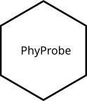
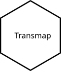
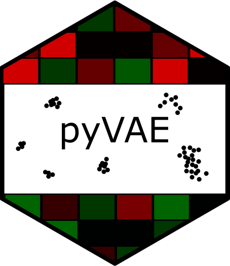

 

# Software/Apps

## IGV [:fontawesome-solid-globe:](https://rhettrautsaw.github.io/IGV/) [:fontawesome-brands-github:](https://github.com/RhettRautsaw/IGV)

Browser-accessible IGV instance for viewing genomic tracks and sequence-alignment data.

## PureTargetViz [:fontawesome-solid-globe:](https://rhettrautsaw.github.io/PureTargetViz/) [:fontawesome-brands-github:](https://github.com/RhettRautsaw/PureTargetViz)

Visualization utility for PureTarget outputs and target-analysis summaries.

## VenomMaps [:fontawesome-solid-globe:](https://rhettrautsaw.github.io/VenomMaps/) [:fontawesome-brands-github:](https://github.com/RhettRautsaw/VenomMaps)

Shiny app for exploring New World pitviper distributions, niche models, and occurrence records for research, conservation, and snakebite-related medical reference. 

Supplemental software: autokuenm [:fontawesome-brands-github:](https://github.com/RhettRautsaw/VenomMaps/tree/master/code/autokuenm)

## ToxCodAn [:fontawesome-brands-github:](https://github.com/RhettRautsaw/ToxCodAn)

Toxin annotator and guide for venom gland transcriptomics.

[ToxCodAn Guide to Venom Gland Transcriptomics](https://github.com/RhettRautsaw/ToxCodAn/tree/master/Guide)

## BiologyPhdStipends [:fontawesome-solid-globe:](https://mlgaynor.com/BiologyPhDStipends/) [:fontawesome-brands-github:](https://github.com/mgaynor1/BiologyPhDStipends)

Database and Shiny app for comparing biology PhD stipends and supporting graduate-student living-wage advocacy.

## MitoSIS [:fontawesome-brands-github:](https://github.com/RhettRautsaw/MitoSIS)

Mitochondrial Species Identification System for mitochondrial genome assembly and sample contamination or mislabeling checks.

## CoordinateMapper [:fontawesome-solid-globe:](https://rhettrautsaw.github.io/CoordinateMapper/) [:fontawesome-brands-github:](https://github.com/RhettRautsaw/CoordinateMapper)

Shiny app for quickly plotting and checking geographic coordinates.

## PhyProbe [:fontawesome-brands-github:](https://github.com/RhettRautsaw/PhyProbe)

Pipeline for extracting phylogenetic loci from next-generation sequencing datasets, including RNA-seq, whole-genome, and target-capture data.

## TransMap [:fontawesome-brands-github:](https://github.com/RhettRautsaw/TransMap)

Pipeline for cross-species comparative transcriptome analyses using homology-weighted transcriptome expression mapping.

## Walter [:fontawesome-brands-github:](https://github.com/RhettRautsaw/Walter)

Bioinformatics utility repository for workflow support and sequence-analysis tasks.

## pyVAE [:fontawesome-brands-github:](https://github.com/RhettRautsaw/pyVAE)

Modified popVAE-style variational autoencoder for generalized multidimensional data such as transcriptome expression matrices.

## HelixText [:fontawesome-solid-globe:](apps/HelixText.md)

Convert text into DNA sequences for fun.

## BaseModViewer [:fontawesome-solid-globe:](apps/BaseModViewer.md)

Visualize modified-base annotations from BAM MM tags.

